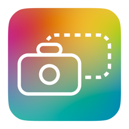

<a href="https://github.com/joelhoke/Screenshottr/releases/download/v1.0.1/Screenshottr-1.0.1-macOS.zip"></a>

# Screenshottr

A small, native menu bar launcher for Apple’s screenshot and screen recording toolbar. Requires macOS 13 or later. No Dock icon, main window, dependencies, network service, or additional global shortcuts.

## [Download Screenshottr for Mac ↓](https://github.com/joelhoke/Screenshottr/releases/download/v1.0.1/Screenshottr-1.0.1-macOS.zip)

**macOS 13+ · Apple Silicon & Intel · Free**

Click the download link above, unzip it, and drag **Screenshottr.app** into **Applications**. See [release notes and checksums](https://github.com/joelhoke/Screenshottr/releases/latest). The Source code downloads are for developers.

The release is a universal app for Apple Silicon and Intel Macs, signed with Developer ID and notarized by Apple. Open the Applications copy, then click the camera in the menu bar. macOS may ask you to approve screen recording access; follow its permission and Quit & Reopen prompts. The small arrow opens Launch at Login and Quit.

## Build and run

Open `Screenshottr.xcodeproj` in Xcode and configure the app target with your development team and an **Apple Development** signing certificate. Both Debug and Release use certificate signing so macOS can recognize the app across rebuilds.

You can keep the team setting local to your checkout: copy `Signing.local.xcconfig.example` to `Signing.local.xcconfig` and replace `YOUR_TEAM_ID` with the team for your certificate. The local file is ignored by Git. You can also select the team directly in Xcode’s Signing & Capabilities editor.

Select the **Screenshottr** scheme and **My Mac**, then Run. The supplied camera icon and a small dropdown arrow appear together in the menu bar.

Or build from Terminal after configuring signing and installing the certificate in your keychain:

```sh
xcodebuild -project Screenshottr.xcodeproj -scheme Screenshottr \
  -configuration Release -derivedDataPath build build
open build/Build/Products/Release/Screenshottr.app
```

## Install

1. Quit any running copy of Screenshottr using its menu.
2. In Finder, open `build/Build/Products/Release` and drag **Screenshottr.app** into **Applications**.
3. Open the copy in Applications. Enable **Launch at Login** from its menu if desired.

Keep a single installed copy, and configure login launch from that copy. Launch at Login is off on a fresh install; the app never registers itself automatically. If macOS requires approval, **Allow in Login Items…** opens the appropriate System Settings page. The checkbox is checked only when macOS reports the service as enabled. Existing registration is respected across app launches.

Local builds use Apple Development signing. Published downloads use Developer ID signing and Apple notarization. App Store distribution is not configured.

## Screen recording permission

Run the installed copy in Applications and approve **Screenshottr** in **System Settings → Privacy & Security → Screen & System Audio Recording**. Quit and reopen that copy if macOS asks.

Avoid ad hoc signing (`CODE_SIGN_IDENTITY=-`) for normal use. macOS can tie an ad hoc app’s permission to its exact code hash; after a rebuild, the checkbox may still look enabled while the new binary no longer matches the saved permission. A stable Apple Development signing identity fixes that underlying identity change. Keep using the same team, certificate identity, and bundle identifier across builds. [Apple’s explanation](https://developer.apple.com/forums/thread/819406)

If upgrading from an older ad hoc build and the permission keeps looping:

1. Quit Screenshottr and finish any capture using Apple’s controls.
2. Install the development-signed build in Applications.
3. Reset only Screenshottr’s old screen-recording entry:

   ```sh
   tccutil reset ScreenCapture com.joelhoke.Screenshottr
   ```

4. Open `/Applications/Screenshottr.app`, click its camera button, and approve Screenshottr in Screen & System Audio Recording. If it is not listed, use the `+` button to add the Applications copy. Follow any macOS Quit & Reopen prompt.

The reset revokes the stale entry; it does not grant screen access or change other apps’ permissions. Approval must be completed by the user. [Apple’s permission controls](https://support.apple.com/guide/mac-help/mchld6aa7d23/mac)

## Use

- **Camera button:** opens Apple’s capture toolbar immediately. Choose a screenshot or recording mode there, then capture.
- **Dropdown arrow:** opens Screenshottr’s app menu with **Launch at Login** and **Quit Screenshottr**. If macOS requires login approval, **Allow in Login Items…** appears too.

The two buttons share one menu bar item, so they stay together when moved. Each has its own click target, tooltip, and accessibility label. The camera image is 27 × 18 points; the subtle dropdown chevron is 3.5 × 2 points with a separate 18-point-wide click area.

Use Apple’s **Options** for the save destination, timer, floating preview, and microphone when recording. Use Apple’s Stop control to finish recording, or Escape to cancel before capture. System audio is not added by Screenshottr.

Screenshottr invokes `/usr/sbin/screencapture -i -U -p -d` without a filename or starting-mode override. `-p` uses the system’s capture settings and destination; the app does not write screenshot preferences or override the microphone, delay, preview, or output location. Apple may remember changes you make in its toolbar, including the last selected area.

The camera button is disabled while the child process is active, including during recording; the settings arrow remains available. Rapid clicks cannot start duplicate capture processes. Cancellation is silent; process launch failures offer Shift–Command–5 as recovery, while `screencapture -d` handles capture errors graphically. Quitting Screenshottr does not forcibly terminate Apple’s capture tool or an ongoing recording; finish recordings using Apple’s Stop control.

## Verification

Run the tests:

```sh
xcodebuild -project Screenshottr.xcodeproj -scheme Screenshottr \
  -configuration Debug -derivedDataPath build -destination 'platform=macOS' test
```

Tests exercise real harmless child processes to check duplicate suppression, return to idle, relaunch, silent nonzero cancellation, and launch failure recovery. They also exercise the camera button’s native action, verify that settings remain available during capture, and check that errors are reported even before opening the app menu. They do not capture the desktop or modify login items.

If Xcode’s test runner times out after building the test bundle, run the tests directly:

```sh
xcrun xctest build/Build/Products/Debug/ScreenshottrTests.xctest
```

For the system integration checks and observed results, see [VERIFICATION.md](VERIFICATION.md).

For signing, notarization, packaging, and GitHub release instructions, see [RELEASING.md](RELEASING.md).

## Project map

- `ScreenshottrApp.swift`: native AppKit application lifecycle, without a main window.
- `StatusBarController.swift`: two adjacent buttons in one status item, the app menu, accessibility labels, and native error alerts.
- `CaptureLauncher.swift`: Apple toolbar arguments and asynchronous child process lifecycle.
- `LoginItemController.swift`: [SMAppService](https://developer.apple.com/documentation/servicemanagement/smappservice) registration and actual system status.
- `Info.plist`: `LSUIElement` and app metadata.
- `Signing.xcconfig`: loads the ignored local development-team configuration for both app build configurations.
- `Assets.xcassets/MenuBarIcon.imageset/`: the supplied SVG, preserved as a vector template image. Both the SVG viewport and the native NSImage are sized to 27 × 18 points to keep the status item at the intended menu bar size. Its color adapts to the system appearance.
- `Assets.xcassets/AppIcon.appiconset/`: the supplied color artwork in macOS app icon sizes for Finder and Applications. The original image is kept in `Artwork/AppIcon.png`; the menu bar uses its separate monochrome asset.
- `ScreenshottrTests/`: process lifecycle regression tests.

The app intentionally runs without App Sandbox so it can invoke Apple’s system capture utility. It uses public Apple frameworks and the locally installed command-line tool; there is no custom capture engine, recording indicator, or editor.
